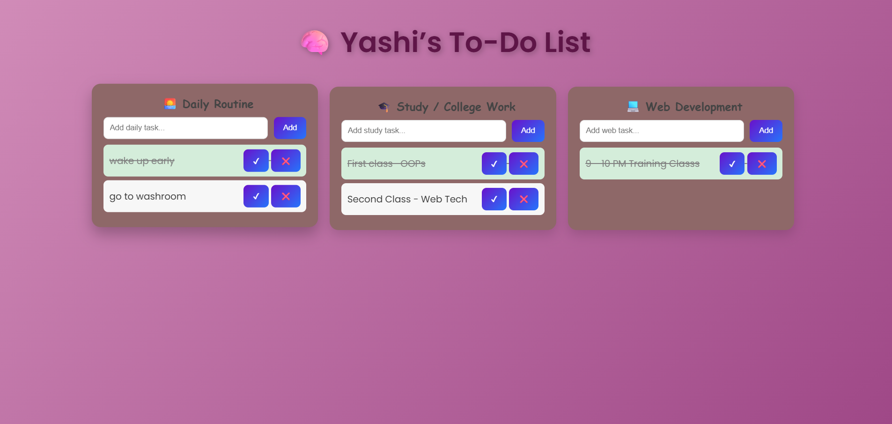

# 📝 To-Do List App

A simple and responsive **To-Do List** web application built using **HTML, CSS, and JavaScript**.  
It allows users to add, delete, and manage their daily tasks efficiently.

---

## 📸 Preview

Here’s how the To-Do List app looks 👇  

### 🖼️ Screenshot 1
.png)

### 🖼️ Screenshot 2

## 🚀 Features
- Add new tasks  
- Mark tasks as completed  
- Delete tasks  
- Responsive design for all devices  

---

## 🛠️ Technologies Used
- HTML  
- CSS  
- JavaScript  

---

## 💡 Future Improvements
- Add local storage to save tasks  
- Add dark/light theme mode  
- Add task filters (completed / pending)

---

## 👩‍💻 Author
**Yashi Vishnoi**

---
